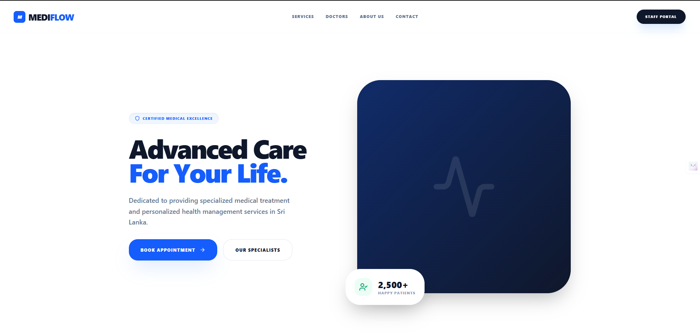
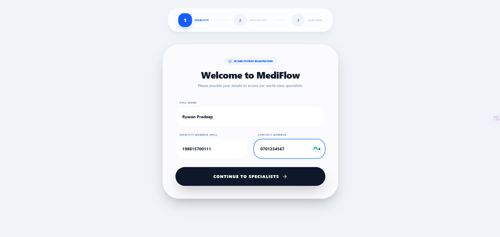
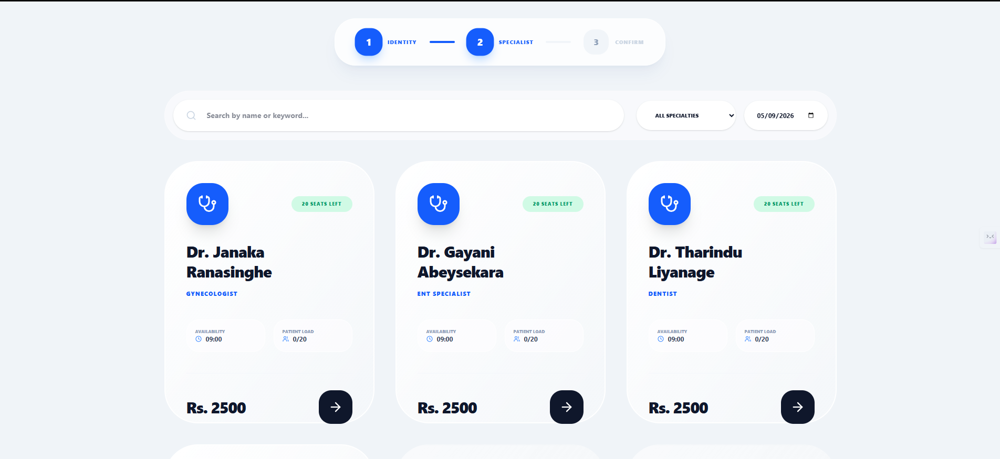
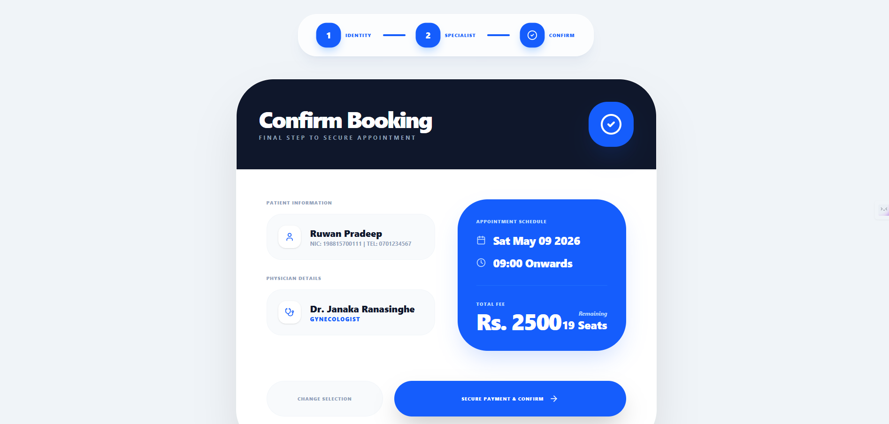
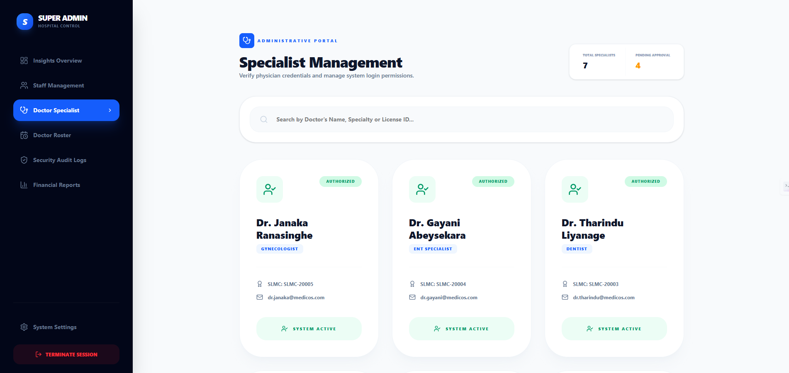

# 🏥 MediFlow Pro - Enterprise Healthcare ERP

MediFlow Pro is a high-performance Hospital Management System (HMS) designed to digitize healthcare workflows and optimize patient data management. Built with a modern tech stack, it focuses on scalability, data integrity, and a seamless user experience.

---

## ✨ Key Features

- **Advanced Specialist Filtering:** Real-time doctor search and category-based filtering logic.
- **Multi-Step Patient Onboarding:** Optimized 3-step registration flow to reduce user friction.
- **Secure Admin Portal:** Role-Based Access Control (RBAC) for managing specialists and physician credentials.
- **ACID Transactions:** Ensures 100% data integrity for secure billing and appointment scheduling.
- **Modern UI/UX:** Clean, responsive design built with Tailwind CSS and Framer Motion.

---

## 📸 System Screenshots

### 1. Patient Landing Page

*Professional healthcare-themed interface for easy navigation.*

### 2. Patient Registration

*Seamless 3-step onboarding process.*

### 3. Specialist Selection

*Real-time availability tracking and filtering.*

### 4. Booking Confirmation

*Secure appointment summary and fee calculation.*

### 5. Payment Success

*Instant feedback upon successful transaction.*

### 6. Administrative Portal (Super Admin)

*Enterprise-level management for specialists and system settings.*

---

## 🛠 Tech Stack

- **Frontend:** React, Next.js, TypeScript, Tailwind CSS
- **Backend:** NestJS / Spring Boot (Microservices Architecture)
- **API:** GraphQL (Apollo Server) & REST API
- **Database:** PostgreSQL with Prisma ORM / MySQL
- **Authentication:** JWT, Spring Security & Role-Based Access Control
- **State Management:** Apollo Client & Zustand

---

## 🚀 Getting Started

1. **Clone the repository:**
   ```bash
   git clone [https://github.com/HirushaDulshaan/patient-care-system.git](https://github.com/HirushaDulshaan/patient-care-system.git)

2. **Install dependencies:**
   ```bash
    npm install
2. **Setup Environment Variables:**
  Create a .env file and add your database URL and JWT secrets.

2. **Run the application:**
   ```bash
    npm run dev

## Security & Design Principles

- **Security:**Implemented JWT-based stateless authentication and secure API endpoints.
- **Performance:** Optimized with Server-Side Rendering (SSR) and efficient client-side caching.
- **Design Philosophy:** Followed a minimalist "Clean UI" approach for maximum accessibility


